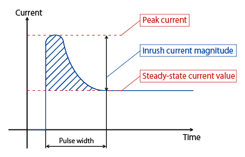
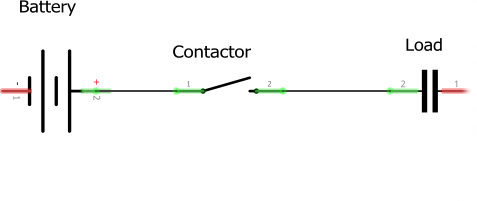
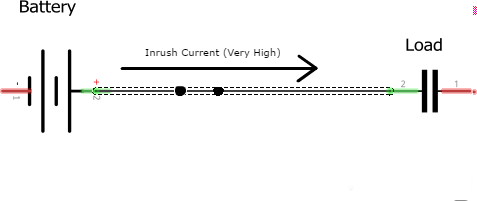
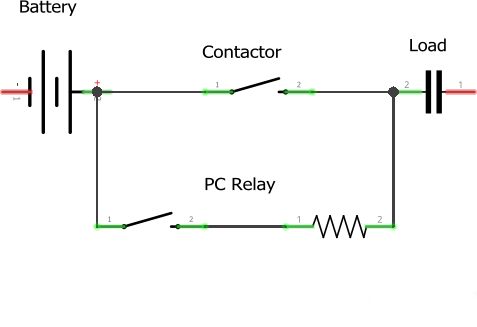
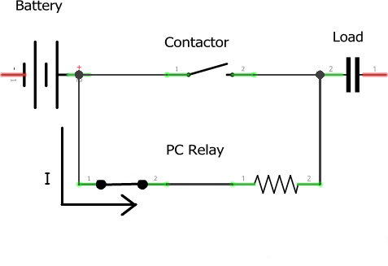
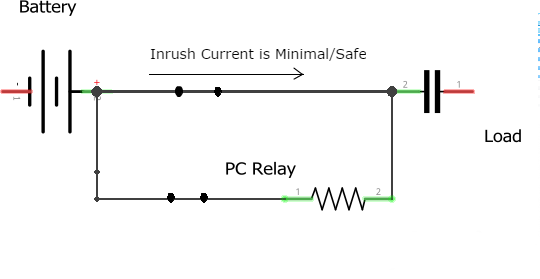

# Aux BMS

The Aux BMS supplements the Orion BMS and has 3 Main functions:

    1. Monitor and transmit the voltage of the auxiliary battery
    2. Handle precharge. Without precharge, overcurrent will occur when the contactor closes. Precharge controls the rise of the voltage until it is safe and then lets the contactors close. The charging and discharge contactors go through the precharge process.
    3. Monitor inputs from Orion BMS and open or close the contactors accordingly.

There are 4 contactors on the battery circuit:

    1. Common - This contactor is always on when the car is running. Should this be turned off, the battery will be disconnected from the rest of the circuit.
    2. Charging - This contactor should be on to allow the car to charge. When the temperature is above a specified threshold, the charging contactor is switched off.
    3. Discharge - This contactor should be switched on to allow the pack to power the car. When the temperature is above a specified value, the contactor is switched off. The temperature threshold for discharge is greater than the threshold for charging.
    4. Array - The only contactor that is separate from the battery pack. This contactor opens and closes with the charging contactor, and disconnects the array from the battery pack.
    
    
image:References/ContactorSetup.jpg[]

For fault situations, all contactors should be switched off.

## What is Precharge?

When initially connecting a battery to a load, there is an inrush current as the load capacitance is charged to a battery voltage. This current is very high, and will cause damage to the relay contacts and put considerable stress to the system.

  

To prevent this, a precharge circuit is placed to control the rise of the voltage. 
This allows the capacitors in the load to charge slowly before the contactor closes.

 

At around 90% to 95% capacity, the contactor is then closed. 
This will insure that there is less voltage across the closing contactors and that there will be little to no inrush current.

## Precharge Workflow

1. The Orion BMS sends signals to close the contactor
2. Aux BMS receives it and closes the PC Relay
3. Aux BMS Monitors the current through the contactor
4. At a safe current, Aux BMS attempts to close the contactor
5. Aux BMS then opens the PC Relay

Note: It's important to ensure that the Contactor and the Relay are not being closed at the same time, otherwise a fuse will blow.

## Startup Sequence

1. The Common contactor goes through the precharge workflow. 
If the Aux BMS is unable to close the contactor, an error is reported via the Aux Status CAN message and it tries again. 

2. The Charge contactor goes through the precharge workflow. 
If the Aux BMS is unable to close the contactor, an error is reported via the Aux Status CAN message. 
If the Discharge contactor has already been closed, it tries to close the Charge contactor again, otherwise it tries to close the Discharge contactor.
If it detects that the Common contactor or Discharge contactor (if it was previously closed) has somehow been disconnected, it closes all contactors and reports an error via the Aux Status CAN message and does not try to close the contactors anymore.

3. The Discharge contactor goes through the precharge workflow. 
If the Aux BMS is unable to close the contactor, an error is reported via the Aux Status CAN message. 
If the Charge contactor has already been closed, it tries to close the Discharge contactor again, otherwise it tries to close the Charge contactor. 
If it detects that the Common contactor or Charge contactor (if it was previously closed) has somehow been disconnected, it opens all contactors and reports an error via the Aux Status CAN message and does not try to close the contactors anymore.

4. Once all the contactors have been closed. The startup sequence is done. The Aux BMS will then monitor the contactors to ensure that they do not open.
If the Common contactor opens, then all contactors are opened and an error is reported via CAN.
If the Charge or Discharge contactor open, and it was not due to Orion BMS signals, then all contactors are opened and an error is reported via CAN. 
If the Charge or Discharge contactor open, and it was due to Orion BMS signals, then the Aux BMS tries to close that contactor again.

Note: At any point, the closing of contactors can be stopped and blocked due to a message (GPIO or CAN) from Orion BMS.

## Orion BMS Interaction
The Orion BMS supplies 3 GPIO inputs (Charge Enable, Discharge Enable, and Safety), and transmits the maximum cell voltage, minimum cell voltage, and highest cell temperature via CAN.

.The Safety GPIO input is not monitored by Aux BMS, but the Charge Enable and Discharge Enable are acted upon once the startup sequence has been completed in the following way:
* If both of the charge AND discharge relays are opened, the car will trip (open all contactors, disable high voltage and strobe BMS).
* If Charge Enable goes low, then the charge contactor is opened.
    ** Orion will tell the charge contactor to open when:
    *** The highest cell temperature is greater than 44&#176;C - the car should not be charging to prevent damage to the battery.

    ** Aux BMS will tell the charge contactor to open when:
    *** The Orion reports that the highest cell voltage is higher than 4.15 V.
    ** The car will trip due to the charge contactor under these circumstances:
     *** The Orion reports that the high cell voltage is greater than 4.20 V (Battery Maximum) 
     *** The Orion reports that the highest cell temperature is greater than 44&#176;C, but Orion is reporting a negative pack current, i.e. The car is still charging.
    *** The Orion reports that the charging current is more than 47 A.

* If Discharge Enable goes low, then the discharge contactor is opened and the high voltage is disabled.
    ** Orion will tell the discharge contactor to open and disable high voltage when:
    *** The highest cell temperature is greater than 59&#176;C. The car should not be discharging to prevent damage to the battery.

    ** Aux BMS will tell the discharge contactor to open and disable high voltage when:
    *** The Orion reports that the lowest cell voltage is lower than 2.60 V.

    ** The car will trip due to the discharge contactor under these circumstances:
     *** The Orion reports that the lowest cell voltage is lower than 2.55 V (Battery Minimum) 
     *** The Orion reports that the highest cell temperature is greater than 59&#176;C, but Orion is reporting a positive pack current, i.e. The car is still discharging.
    *** The Orion reports that the pack current is more than 229 A.

## Inputs/Outputs
The Aux BMS will send and receive CAN messages according to the https://docs.google.com/spreadsheets/d/1soVLjeD9Sl7z7Z6cYMyn1fmn-cG7tx_pfFDsvgkCqMU/edit?usp=sharing[Epsilon Communications Protocol.^]

### CAN Inputs
|=======================
|*CAN Address* |*Name* |*Purpose*
|0x305 | Orion BMS Cell Voltages | Messages about the maximum and minimum cell voltages
|0x304 | Orion BMS TempInfo | Messages about the cell temperatures
|0x703 | Driver | Contains information on the car's mode (forward, reverse, aux)
|=======================

### CAN Outputs
|=======================
|*CAN Address* |*Name* |*Purpose*
|0x720 | Heartbeat | Always 1, to confirm the board is sending messages
|0x721 | Aux Status | Information on which contactors are closed, the auxilliary battery voltage, high voltage enable, contactor errors, allowing charge, and BMS strobe light.
|=======================

### GPIO
|=======================
|*Name*|  *Purpose* | *Direction*
|Red LED | Toggles each time a heartbeat CAN message is sent | Output
|Blue LED | Toggles each time an Aux Status CAN message is sent | Output
|Contactor Enables | Is high when Aux BMS allows a contactor to close (Common, Charge, Discharge) | Output
|Contactor Senses | Indicates if a contactor has been fully closed | Input
|Orion BMS Charge Enable | Is high when Orion BMS allows charge | Input
|Orion BMS Discharge Enable | Is high when Orion BMS allows discharge | Input
|=======================

## More Reading:

https://en.wikipedia.org/wiki/Inrush_current

https://en.wikipedia.org/wiki/Pre-charge

http://liionbms.com/php/precharge.php

https://docs.google.com/document/d/1nIhDM4bE6hG3EAUMPlWgmF01TrC3XhC8S5vXUH4yx7w/mobilebasic?fbclid=IwAR1DrjbJ1w0A6Zo8h5Hx7N7Vd01yUadBAWVDdVAqYjIz0Y17WJwh9uOi4PU[Aux Bms Requirements]

