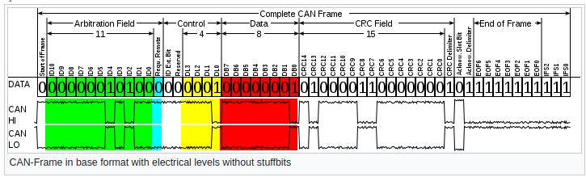

*CAN - Controller Area Network*
------------------------------

*What is CAN?*
~~~~~~~~~~~~~
* CAN is a vehicle bus standard that allows microcontrollers and electronic devices to communicate whith each other without a host computer
* It is a message based protocol

*CAN protocol*
~~~~~~~~~~~~~~
CAN protocol is a set of rules for transmitting and receiving messages in a network of electronic devices. It was designed specifically looking into the needs of the automobile industry but is now used in many other indutsries as well.

*How does it work?*
^^^^^^^^^^^^^^^^^^
* Every electronic device (also know as a node) which needs to communicate using the CAN protocol is connected via a common serial bus to transmit and receive messages
* For data to be exhanged among the nodes, each device must have the necesarry hardware and software embedded inside of them. Every node should have:
    - A Host Controller (ECU/MCU) - responsible for functioning of respective node
    - CAN Controller - converts the node messages in accordance with the CAN protocol to be transmitted via CAN transceiver over the serial bus and vice versa
    - CAN Transceiver
* CAN does not follow the master-slave architechture so each device (node) has access to read and write data on the CAN bus
* When a node is ready to send data it checks availability of the bus and writes a CAN frame to the network

*CAN Messages*
^^^^^^^^^^^^^^
* A message is a packet of data that carries information to be exchanged between the nodes
* A CAN message is made up of 10 bytes of data and is sent in a format called a frame
* A frame has a defined structure and carries a meaningful sequence of bits or bytes of data
* There are two types of frames:
    - standard: 11 bit identifier fields (Solar Car uses this)

    - exetended: 29 bit identifier fields
* All nodes on CAN receive the CAN frame and depending on the ID on the node CAN decides whether to accept it or not
* If multiple nodes send the message at the same time then the node with the highest priority (lowest arbitration ID) will get bus access and low priroty nodes wait until the bus is available

Note: The CAN network needs two terminating resistors in order to work - two 120ohm resistors in parallel (A total of 60 ohms)
