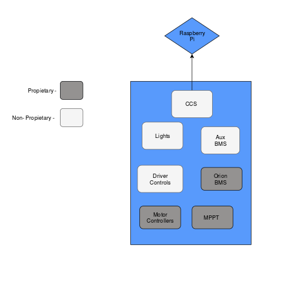

In Car Embedded Systems
------------------------

The In-Car embedded systems are a mixture of custom printed circuit boards using the https://www.st.com/content/st_com/en/products/evaluation-tools/product-evaluation-tools/mcu-eval-tools/stm32-mcu-eval-tools/stm32-mcu-discovery-kits/stm32f4discovery.html[STM32F4 Discovery Processors] and proprietary systems. 
Proprietary systems are in use for the battery monitoring system (BMS), motor controllers, and the maximum power point trackers (MPPTs).

Proprietary Systems: 

* https://www.dilithiumpower.com/products/photon-1[Dilithium MPPTs]
* https://www.orionbms.com/products/orion-bms-original/[Orion BMS]
* https://tritium.com.au/products/wavesculptor22-motor-inverter/[Tritium Motor Controllers]

Gen5 CAN Layout
---------------

Notes
^^^^^
A proprietary system is a system that was bought from an outside source and contains software that we don't make changes to. 
The reason we have an Aux BMS is because the Orion BMS does not give enough information to suit our needs.

link:References/TRI67.010v2_BMS_BMU_Communications_Protocol.pdf[TRI67.010v2_BMS_BMU_Communications_Protocol.pdf] - BMS Datasheet

link:References/TRI88.004v4-Users-Manual.pdf[TRI88.004v4-Users-Manual.pdf] - Motor Controller Datasheet

link:References/PhotonDatasheetrev1_2.pdf[PhotonDatasheetrev1_2.pdf] - MPPT Datasheet

link:References/Gen5CanLayout.png[Gen5CanLayout.png] 

